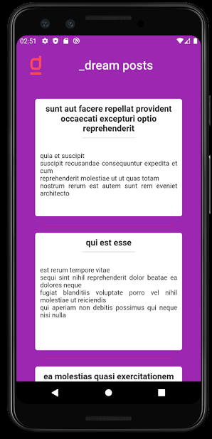
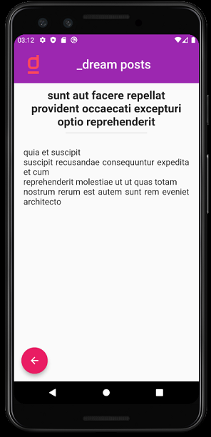

# dreamposts

Projeto desenvolvido para iniciar o aprendizado em Flutter, que também envolveu acesso a conteúdo externo.

## Começando

Para executar o projeto será necessário instalar o Flutter.
Utilize a documentação do Flutter para instalá-lo disponível em: 
* https://flutter.dev/docs/get-started  

Além do Flutter, é necessário ter um emulador de Android/iOS ou um aparelho celular para 
executar o projeto. Você pode, por exemplo, utilizar o emulador do Android Studio, a documentação acima também auxilia a instalá-lo.

## Desenvolvimento
Para iniciar o desenvolvimento, é necessário clonar o projeto do GitHub num diretório de sua preferência:

`cd "diretorio de sua preferencia"`  
`git clone https://github.com/mateuss-oliveira/dreamPosts`

## Construção

Para construir o projeto com o Flutter, acesse a pasta que contém o projeto e escolha um dispositivo para executar a aplicação.
Para ver os dispositivos disponíveis execute o comando:  
`flutter devices` 
Após escolher o dispositivo, execute o comando:  
`flutter run -d "nome do dispositivo escolhido"` 
O comando irá executar a aplicação do dispositivo escolhido.

## Features

O projeto pode ser usado como modelo para iniciar o desenvolvimento de um projeto utilizando Flutter.
Ele também demonstra de forma prática como acessar conteúdo externo de uma API.

## Status do Projeto

Projeto concluído.

## Visualização

As páginas da aplicação podem ser visualizadas abaixo:

- Página inicial 

  
- Página contendo detalhes de um post 

